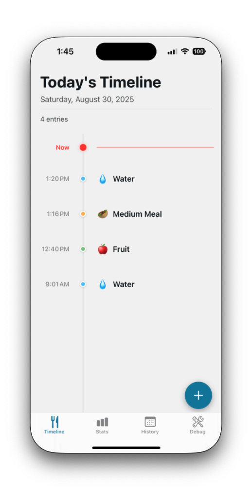
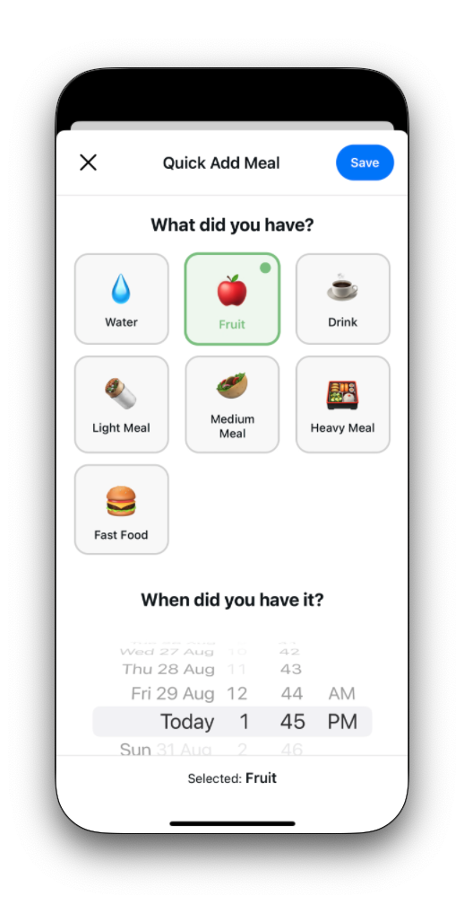
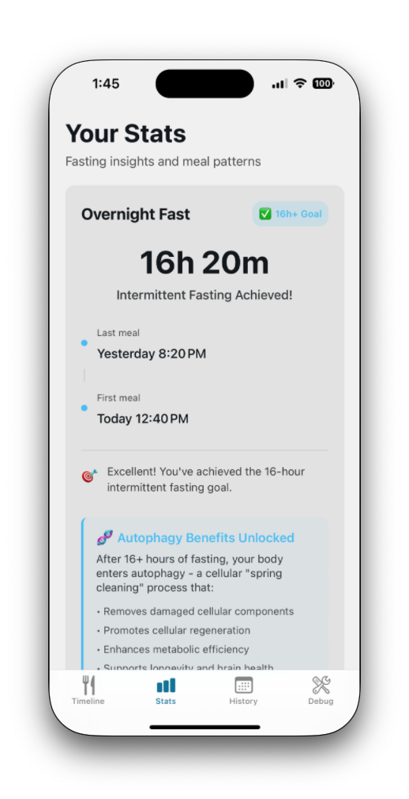

# GutRest: Meal & Fasting Tracker App

### 1. **App Idea**

The GutRest app is designed to help users build healthier eating routines by **logging meal types and timings** in the simplest possible way.
Instead of calorie tracking or detailed food diaries, the app focuses on:

- Quickly recording what type of intake occurred (e.g., water, fruit, light meal, etc.).
- Highlighting **gaps between meals** and **fasting windows** (e.g., dinner → next breakfast).
- Providing **simple, meaningful insights** around intermittent fasting and eating habits.

This lightweight approach ensures long-term usability without overwhelming the user.

    
    
    

---

### 2. **Target User**

- Individuals interested in **intermittent fasting**.
- People who want to be mindful of their **meal timing** without calorie counting.
- Users seeking a **minimalist meal tracking tool**.

---

### 3. **Core Principles**

- **Simplicity over detail**: One-tap logging instead of complex food diaries.
- **Low effort**: Quick actions for busy users.
- **Meaningful insights only**: Show gaps, fasting windows, and patterns — no unnecessary data.

---

### 4. **Current Features**

**Screens & Features**:

1. **Home (Timeline Screen)**

   - Vertical timeline of today’s intake.
   - Each entry shows: icon + category + time.
   - Gap between entries automatically displayed (e.g., “⏱ 3h 20m since last meal”).
   - Floating **+ button** to add new intake.

2. **Quick Add Modal**

   - Opens when user taps “+”.
   - Large tappable icons for meal categories:

     - 💧 Water
     - 🍎 Fruit
     - ☕ Drink
     - 🌯 Light Meal
     - 🥙 Medium Meal
     - 🍱 Heavy Meal
     - 🍔 Fast Food

   - Defaults to current time but user can adjust.
   - Save → adds to timeline.

3. **Stats (Insights Screen)**

   - **Fasting Tracker**:
     - Calculates gap between last intake of yesterday and first intake of today.
     - Highlights ✅ if ≥ 16 hours (intermittent fasting achieved).

4. **History View**
   - Previous history of meals.
   - Daily fasting achievements marked with ✅.

---
