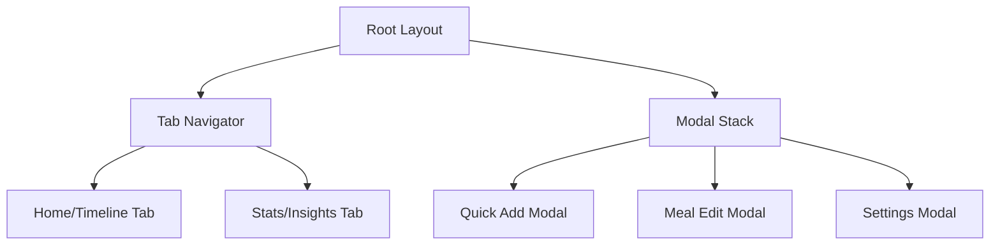

# GutRest App - Technical Architecture Plan

## Executive Summary

This document outlines the comprehensive architecture for the GutRest meal & fasting tracker app, built on the existing Expo + React Native foundation. The architecture focuses on simplicity, performance, and user experience while supporting the core features of meal logging, gap tracking, and fasting insights.

## Current Project Analysis

### Existing Foundation

- **Framework**: Expo SDK 53 with React Native 0.79.6
- **Navigation**: Expo Router with file-based routing
- **Architecture**: TypeScript-first with strict typing
- **UI System**: Custom themed components with light/dark mode support
- **Dependencies**: Well-curated set including React Navigation, Expo Haptics, and essential Expo modules

### Strengths to Leverage

1. **Expo Router**: Provides excellent file-based routing system
2. **Themed Components**: Existing `ThemedText` and `ThemedView` for consistent UI
3. **TypeScript**: Strong typing foundation already established
4. **Haptic Feedback**: Already configured for enhanced UX
5. **Tab Navigation**: Base structure already implemented

## 1. Navigation Architecture

### Recommended Strategy: Hybrid Tab + Modal Stack



#### Implementation Details

**Tab Structure**:

- **Home Tab**: Timeline view of daily intake
- **Stats Tab**: Insights and fasting tracking
- **Optional 3rd Tab**: History/Calendar view (V1.1)

**Modal Stack**:

- **Quick Add Modal**: Primary meal logging interface
- **Edit Modal**: For modifying existing entries
- **Settings Modal**: App configuration

#### File Structure:

```
app/
├── _layout.tsx              # Root layout with modal stack
├── (tabs)/
│   ├── _layout.tsx          # Tab navigator configuration
│   ├── index.tsx            # Home/Timeline screen
│   ├── stats.tsx            # Stats/Insights screen
│   └── history.tsx          # History screen (V1.1)
├── (modals)/
│   ├── quick-add.tsx        # Quick add meal modal
│   ├── edit-entry.tsx       # Edit meal entry modal
│   └── settings.tsx         # Settings modal
└── +not-found.tsx
```

## 2. Data Models

### Core Data Structures

```typescript
// Types for meal categories
export type MealCategory =
  | "water"
  | "fruit"
  | "light_meal"
  | "medium_meal"
  | "heavy_meal"
  | "fast_food"
  | "drink";

// Main meal entry interface
export interface MealEntry {
  id: string;
  category: MealCategory;
  timestamp: number; // Unix timestamp in milliseconds
  date: string; // YYYY-MM-DD format for easy querying
  notes?: string; // Optional user notes
  createdAt: number;
  updatedAt: number;
}

// Category configuration
export interface CategoryConfig {
  id: MealCategory;
  icon: string; // Emoji or icon name
  label: string;
  color: string; // Hex color for theming
  order: number; // Display order in quick add
}

// Daily summary for stats
export interface DailySummary {
  date: string; // YYYY-MM-DD
  entries: MealEntry[];
  totalEntries: number;
  firstIntake?: number; // Timestamp of first intake
  lastIntake?: number; // Timestamp of last intake
  gaps: TimeGap[];
  fastingWindow?: FastingWindow;
}

// Time gap between meals
export interface TimeGap {
  startTime: number;
  endTime: number;
  durationMs: number;
  durationFormatted: string; // "3h 20m"
}

// Fasting tracking
export interface FastingWindow {
  startTime: number; // Last intake of previous day
  endTime: number; // First intake of current day
  durationMs: number;
  durationFormatted: string;
  isIntermittentFasting: boolean; // >= 16 hours
}
```

## 3. Storage Strategy

### Recommended: Expo SQLite + AsyncStorage Hybrid

#### Primary Storage: Expo SQLite

- **Rationale**: Structured queries, better performance for time-based operations, relationships
- **Use Cases**: Meal entries, daily summaries, historical data

```sql
-- Meal entries table
CREATE TABLE meal_entries (
  id TEXT PRIMARY KEY,
  category TEXT NOT NULL,
  timestamp INTEGER NOT NULL,
  date TEXT NOT NULL,
  notes TEXT,
  created_at INTEGER NOT NULL,
  updated_at INTEGER NOT NULL
);

-- Indexes for performance
CREATE INDEX idx_meal_entries_date ON meal_entries(date);
CREATE INDEX idx_meal_entries_timestamp ON meal_entries(timestamp);
```

#### Secondary Storage: AsyncStorage

- **Use Cases**: User preferences, app settings, onboarding state
- **Keys**: `@gutrest:settings`, `@gutrest:onboarding`, `@gutrest:theme`

#### Implementation Details:

```typescript
// Database service interface
export interface DatabaseService {
  // Meal entries
  insertMealEntry(entry: Omit<MealEntry, "id">): Promise<MealEntry>;
  updateMealEntry(id: string, updates: Partial<MealEntry>): Promise<void>;
  deleteMealEntry(id: string): Promise<void>;
  getMealEntriesByDate(date: string): Promise<MealEntry[]>;
  getMealEntriesInRange(
    startDate: string,
    endDate: string
  ): Promise<MealEntry[]>;

  // Analytics queries
  getDailySummary(date: string): Promise<DailySummary>;
  getWeeklySummaries(startDate: string): Promise<DailySummary[]>;
}
```

## 4. Component Architecture

### Folder Structure

```
components/
├── ui/                      # Base UI components
│   ├── ThemedText.tsx       # Already exists
│   ├── ThemedView.tsx       # Already exists
│   ├── Button.tsx           # Custom button component
│   ├── Modal.tsx            # Custom modal wrapper
│   ├── IconButton.tsx       # Icon-based buttons
│   └── LoadingSpinner.tsx   # Loading states
├── timeline/                # Timeline-specific components
│   ├── TimelineView.tsx     # Main timeline container
│   ├── TimelineEntry.tsx    # Individual meal entry
│   ├── TimelineGap.tsx      # Gap indicator component
│   └── EmptyTimeline.tsx    # Empty state
├── quick-add/               # Quick add modal components
│   ├── QuickAddModal.tsx    # Main modal container
│   ├── CategoryGrid.tsx     # Category selection grid
│   ├── CategoryButton.tsx   # Individual category button
│   └── TimeSelector.tsx     # Time adjustment component
├── stats/                   # Stats screen components
│   ├── StatsView.tsx        # Main stats container
│   ├── FastingTracker.tsx   # Fasting window display
│   ├── GapSummary.tsx       # Daily gap statistics
│   └── WeeklyChart.tsx      # Weekly overview (V1.1)
└── common/                  # Shared components
    ├── HeaderTitle.tsx      # Screen headers
    ├── FloatingButton.tsx   # FAB for quick add
    └── ConfirmDialog.tsx    # Confirmation dialogs
```

### Design System Considerations

```typescript
// Extended theme colors for meal categories
export const MealColors = {
  light: {
    water: "#4FC3F7",
    fruit: "#81C784",
    light_meal: "#AED581",
    medium_meal: "#FFB74D",
    heavy_meal: "#FF8A65",
    fast_food: "#F06292",
    drink: "#BA68C8",
  },
  dark: {
    water: "#0288D1",
    fruit: "#388E3C",
    light_meal: "#689F38",
    medium_meal: "#F57C00",
    heavy_meal: "#E64A19",
    fast_food: "#C2185B",
    drink: "#7B1FA2",
  },
};
```

## 5. State Management Strategy

### Recommended: React Context + Custom Hooks

#### Rationale:

- **Simple enough**: App state is relatively straightforward
- **Performance**: Optimized contexts prevent unnecessary re-renders
- **Type Safety**: Full TypeScript integration
- **Maintenance**: Easy to understand and modify

#### Architecture:

```typescript
// Contexts
export const MealDataContext = React.createContext<MealDataContextType>();
export const SettingsContext = React.createContext<SettingsContextType>();

// Custom hooks
export const useMealData = () => useContext(MealDataContext);
export const useSettings = () => useContext(SettingsContext);
export const useTimelineData = (date: string) => {
  /* ... */
};
export const useStatsData = (date: string) => {
  /* ... */
};
export const useFastingTracker = () => {
  /* ... */
};
```

#### Context Structure:

```typescript
interface MealDataContextType {
  // Current day data
  todayEntries: MealEntry[];
  todaySummary: DailySummary | null;

  // Actions
  addMealEntry: (entry: Omit<MealEntry, "id">) => Promise<void>;
  updateMealEntry: (id: string, updates: Partial<MealEntry>) => Promise<void>;
  deleteMealEntry: (id: string) => Promise<void>;

  // Loading states
  isLoading: boolean;
  error: string | null;

  // Cache management
  refreshData: () => Promise<void>;
  clearCache: () => void;
}
```

## 6. Time Calculation Approach

### Business Logic Service

```typescript
export class TimeCalculationService {
  /**
   * Calculate gaps between consecutive meal entries
   */
  static calculateGaps(entries: MealEntry[]): TimeGap[] {
    // Sort entries by timestamp
    // Calculate time differences
    // Format duration strings
  }

  /**
   * Calculate fasting window between days
   */
  static calculateFastingWindow(
    lastEntryYesterday: MealEntry | null,
    firstEntryToday: MealEntry | null
  ): FastingWindow | null {
    // Calculate overnight fasting duration
    // Determine if >= 16 hours (intermittent fasting)
  }

  /**
   * Format duration in human-readable format
   */
  static formatDuration(milliseconds: number): string {
    // Convert to "3h 20m" format
  }

  /**
   * Get daily statistics
   */
  static getDailyStats(summary: DailySummary): {
    shortestGap: TimeGap | null;
    longestGap: TimeGap | null;
    averageGap: number;
    totalGaps: number;
  } {
    // Calculate gap statistics
  }
}
```

### Performance Optimizations

- **Memoization**: Cache calculated values using React.useMemo
- **Background Processing**: Calculate heavy computations off main thread
- **Incremental Updates**: Only recalculate when data changes

## 7. File Organization

### Recommended Project Structure

```
gut-rest/
├── app/                     # Expo Router screens
├── components/              # Reusable UI components
├── services/               # Business logic services
│   ├── database.ts         # Database operations
│   ├── timeCalculation.ts  # Time/gap calculations
│   ├── storage.ts          # AsyncStorage operations
│   └── notifications.ts    # Push notifications (future)
├── hooks/                  # Custom React hooks
│   ├── useMealData.ts      # Meal data management
│   ├── useTimelineData.ts  # Timeline-specific data
│   ├── useStatsData.ts     # Stats calculations
│   └── useFastingTracker.ts # Fasting window tracking
├── contexts/               # React contexts
│   ├── MealDataContext.tsx # Main app state
│   └── SettingsContext.tsx # User preferences
├── types/                  # TypeScript type definitions
│   ├── meal.ts            # Meal-related types
│   ├── stats.ts           # Statistics types
│   └── api.ts             # API interfaces
├── constants/             # App constants
│   ├── Colors.ts          # Existing theme colors
│   ├── MealCategories.ts  # Meal category definitions
│   └── Settings.ts        # Default settings
├── utils/                 # Utility functions
│   ├── dateHelpers.ts     # Date manipulation
│   ├── formatters.ts      # Data formatting
│   └── validation.ts      # Input validation
└── assets/               # Static assets
```

## 8. Implementation Phases

### Phase 1: Core Foundation (Week 1-2)

- [ ] Set up data models and TypeScript types
- [ ] Implement SQLite database service
- [ ] Create basic contexts and providers
- [ ] Build core UI components

### Phase 2: Timeline & Quick Add (Week 2-3)

- [ ] Implement timeline view with gap calculations
- [ ] Build quick add modal with category selection
- [ ] Add floating action button
- [ ] Integrate time calculation service

### Phase 3: Stats & Insights (Week 3-4)

- [ ] Build stats screen with daily summaries
- [ ] Implement fasting window tracking
- [ ] Add gap statistics display
- [ ] Create achievement indicators

### Phase 4: Polish & Testing (Week 4-5)

- [ ] Add loading states and error handling
- [ ] Implement data persistence
- [ ] Add haptic feedback throughout app
- [ ] Performance optimization and testing

## 9. Technical Considerations

### Performance

- **List Optimization**: Use FlatList for timeline with proper keyExtractor
- **Image Optimization**: Use Expo Image for better performance
- **Memory Management**: Implement proper cleanup in useEffect hooks
- **Database Indexing**: Index frequently queried columns

### Accessibility

- **Screen Reader**: Proper accessibility labels and hints
- **Touch Targets**: Minimum 44px touch targets for buttons
- **Color Contrast**: Ensure sufficient contrast ratios
- **Dynamic Type**: Support system font size preferences

### Error Handling

- **Database Errors**: Graceful fallbacks for database operations
- **Network Issues**: Offline-first approach with local storage
- **User Input**: Validation with clear error messages
- **Crash Recovery**: Error boundaries and crash reporting

### Security & Privacy

- **Local Data**: All data stored locally on device
- **No Analytics**: Privacy-first approach with no tracking
- **Data Export**: Allow users to export their data
- **Data Deletion**: Complete data removal option

## 10. Migration Strategy

### From Current State

1. **Preserve Existing**: Keep current theming and navigation structure
2. **Incremental Updates**: Replace tab content gradually
3. **Data Migration**: No existing data to migrate
4. **Testing**: Maintain existing development workflow

### Future Considerations

- **Cloud Sync**: Optional backend integration for data backup
- **Social Features**: Sharing achievements (optional)
- **Advanced Analytics**: More detailed insights and trends
- **Notifications**: Reminder system for meal logging

## Conclusion

This architecture provides a solid foundation for the GutRest app while maintaining simplicity and focusing on the core user experience. The modular design allows for easy maintenance and future enhancements while the local-first approach ensures privacy and performance.

The recommended technology stack leverages the existing Expo foundation while adding minimal complexity. The focus on TypeScript, local storage, and context-based state management provides a maintainable and scalable solution that can grow with the app's needs.
